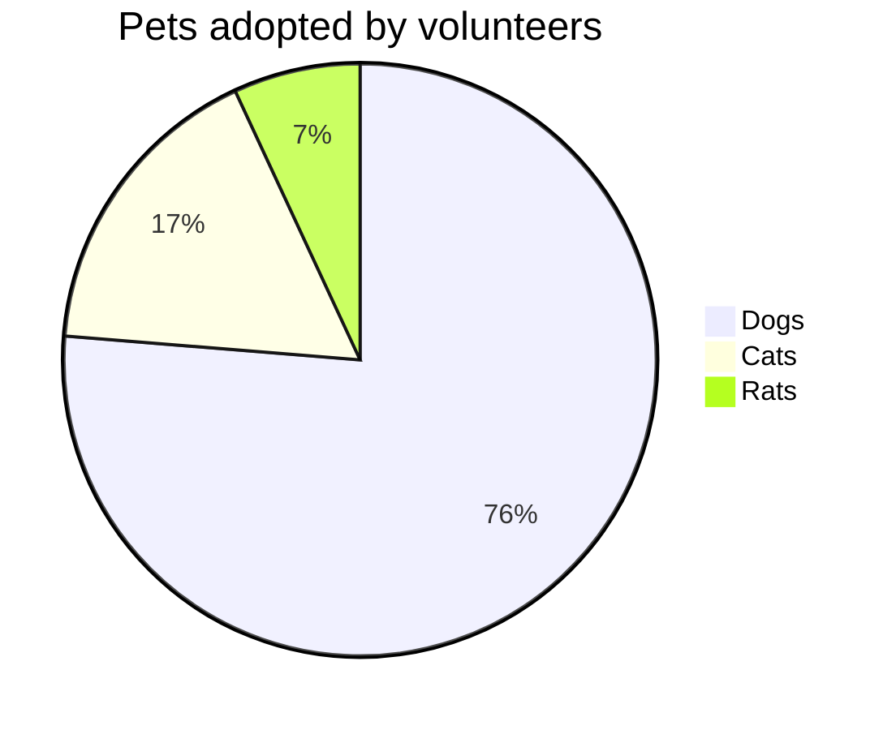

# {{ page.title }}

> In Überarbeitung

## Anmeldung / Schutzstatus S
Die Schweiz hilft schutzbedürftigen Personen, die aus der Ukraine geflüchtet sind, schnell und unbürokratisch.
Alle Personen, die ihren Wohnsitz vor dem 24. Februar in der Ukraine hatten, erhalten den **Schutzstatus S** – es gibt keine Kontingentierung!

#### Was bedeutet der Schutzstatus „S“?
Mit dem Schutzstatus «S» erhalten betroffene Personen rasch und unbürokratisch Schutz in der Schweiz – ohne Durchführung eines ordentlichen Asylverfahrens.
Der Schutzstatus «S» gewährt ein Aufenthaltsrecht, Anspruch auf Unterbringung, Unterstützung und medizinische Versorgung und erlaubt den Nachzug von Familienangehörigen. Und ganz wichtig: die Kinder können zur Schule gehen.

#### Wir empfehlen allen Schutzsuchenden, so schnell wie möglich ein Gesuch einzureichen
Dafür müssen Sie sich in einem Bundesasylzentrum registrieren lassen.
Das müssen Sie aber nicht heute und morgen tun – Sie haben dafür bis zu 90 Tage Zeit.
**Nach Gesuch-Einreichung ist die schutzsuchende Person krankenversichert.**

- [Gesuch Schutzzstatus S (pdf) :fire:](https://www.sem.admin.ch/dam/sem/de/data/asyl/gesuch-schutzstatus-s.pdf.download.pdf/gesuch-schutzstatus-s-d.pdf)
- [Staatssekretariat für Migration SEM](https://www.sem.admin.ch/sem/de/home.html)
